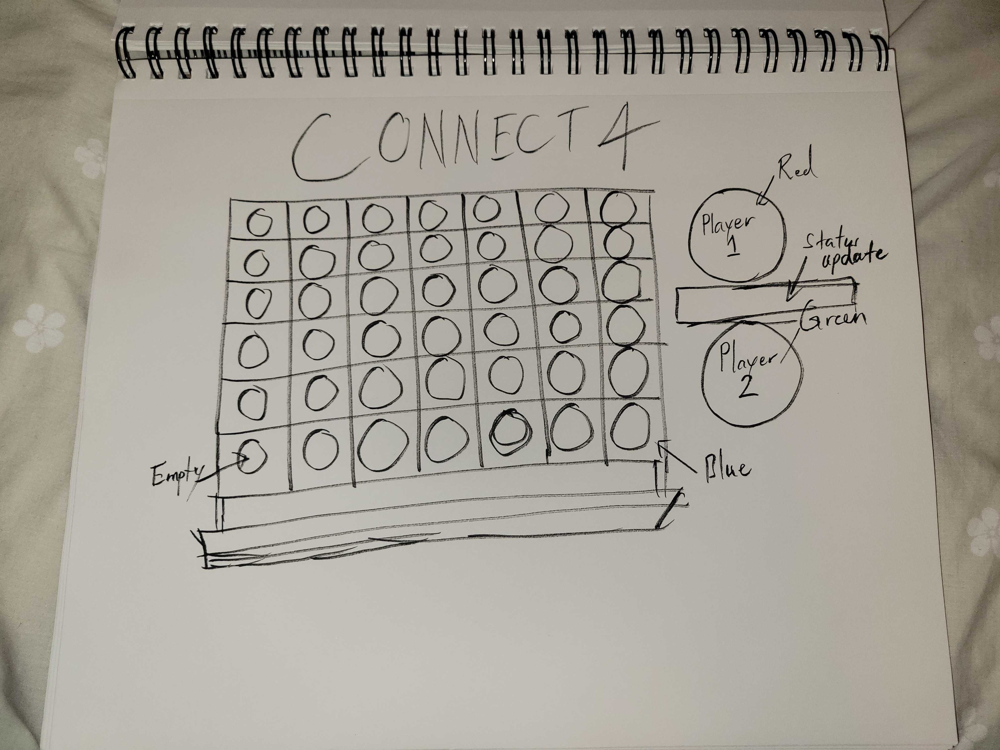

## <u>_Pseudocode_</u>

1. Declare required constants:

    1.1. For each player, turn counter, status window, play button, reset button

    1.2. Set array for all possible slot options

2. Define vars for keeping track of game

    2.1. A turn counter to track should the board fill up with no winners, 42 turns max

    2.2. Setting a var to represent if a player wins, loses or ties

3. Define a var to store previous turns moves with each players color value in an array

4. Upon pressing play

    4.1. Wipes all values from the slots, welcome message to the game

    4.2. Status window shows who's turn it is, set turn to 1

    4.3. Signal Player to choose a column to drop their disc

    4.4. Wait for player to click

5. When disc is dropped

    5.1. Map column chosen and row reached before end of board/taken slot

    5.2. Using background image to indicate the player move on the board based on mapped location

    5.3. Run fourCheck function to check board to winning combinations 

        5.3.1. if no winnings combos, do nothing

        5.3.2. if any four horzontally adjacent values have a sum of 4 or -4, W#1 (-)

        5.3.3. if any four vertically adjacent values have a sum of -4, W#2 (|)

        5.3.4. if any four diagonally down left (/) or right(\), thats W#3 and 4

    5.4. Change turn to next player using turn * -1 to flip to player states

    5.5. States updated and fourCheck returns nothing  
        5.5.1. Loop back to 4.4
6. When Player hits reset

    6.1. Update status message to snide remark

    6.2. Setting time delay, runs play function, game is reset

## Starting Wireframe

