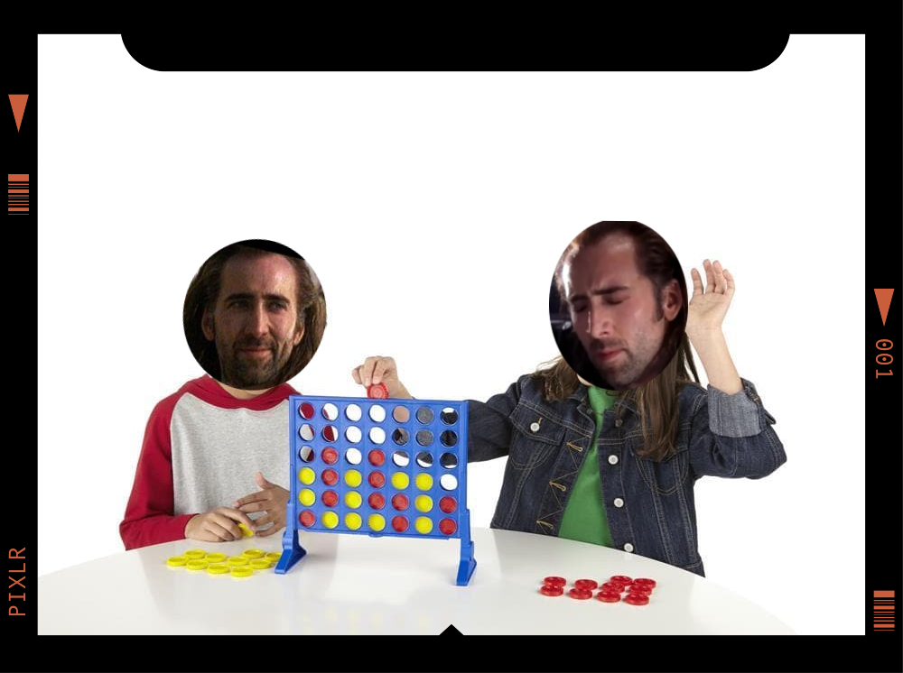
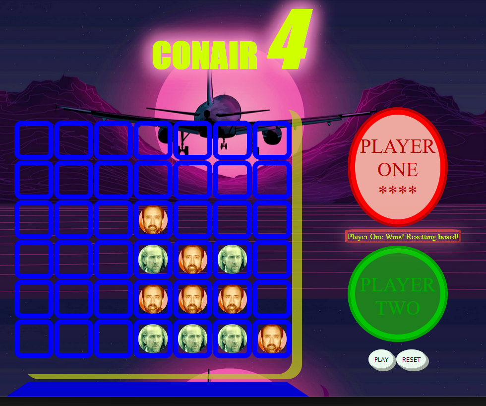

# Project-1-Connect-4

# ***CONAIR 4*** 

FUN FOR THE ENTIRE FAMILY *(if you have a family of 2)*

---
OBJECTIVE:

    To be the first player to connect 4 of the same colored discs in a row (either vertically, horizontally, or diagonally)
---
## Play Here

* [Link to Game](https://rightanglewrong.github.io/Project-1-Connect-4/)
---

## Screenshots:
---

---

## __Technologies Used__
* Javascript
* HTML
* CSS

---

## __Getting Started__

HOW TO PLAY:

    1. Click Play

    2. In alternating turns, players choose the slot in the column inwhich they like to drop their disc. Only 1 disc per turn. 

    3. Wins when there are 4 in a row horizontally, vertically or diagonally. The game reachs a stalemate when the board is fill up with no winner.

    4. The loser of the previous game goes first on the next game.
    * There is a slight delay to win/ board resetting interactions, which may lead to glitches.

---
## <u>__Next Steps: Planned future updates__</u>

* Have discs drop down from the top instead of having event listeners on each slot
* Streamline win logic algorithm
* Add animation for disc dropping to its slot
* Add option to play against AI
